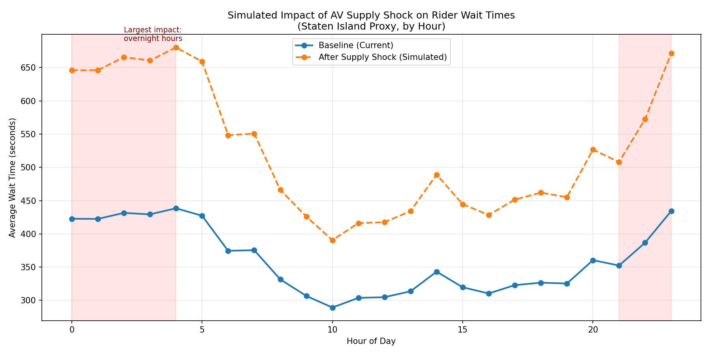
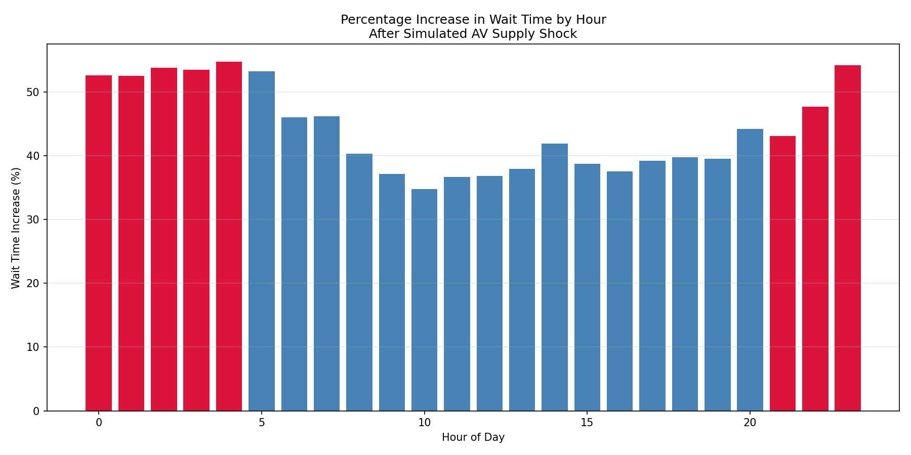

# Modeling Rider-Demand Reallocation After Losing an AV Supply Partner: A Phoenix Case Study

## Overview

In late June 2026, Uber and Waymo ended their autonomous vehicle partnership in Phoenix, Arizona. That removed a portion of the market's driverless vehicle capacity from Uber's platform overnight. This project simulates the likely marketplace impact of that kind of sudden supply shock: what happens to rider wait times when a chunk of a city's vehicle supply disappears, and does the impact hit every hour of the day equally?

Phoenix-level ride data isn't publicly available, so this project uses New York City's public rideshare data as a proxy to build and test the underlying methodology. The same approach would apply directly if real Phoenix data were available.

## Problem Statement

When a rideshare platform loses a meaningful share of its vehicle supply in a market, how does rider wait time respond, and does the impact vary by time of day?

This matters because Uber's marketplace is fundamentally a supply-demand balancing problem. A sudden, uneven loss of capacity, like an AV partner exiting a market, doesn't just raise average wait times. It can hit some hours of the day far harder than others, with direct implications for rider experience, driver incentive strategy, and pricing.

## Data & Methodology

**Data source:** [NYC TLC High Volume For-Hire Vehicle (HVFHV) Trip Records](https://www.nyc.gov/site/tlc/about/tlc-trip-record-data.page), April 2025, filtered to Uber trips only (`hvfhs_license_num == "HV0003"`), about 14.4 million trips.

**Pipeline:**
1. **Data cleaning and optimization.** Dropped unused columns, downcast numeric types, converted repetitive strings to categoricals. This reduced memory footprint from 4.2 GB to roughly 1.3 GB.
2. **Wait time construction.** Calculated `wait_time_sec` as the gap between `request_datetime` and `pickup_datetime`, then filtered outliers above the 99th percentile, since those likely reflect scheduled/reserved rides rather than real-time on-demand requests.
3. **Baseline aggregation.** Built a zone-hour level table of trip counts, average wait time, average fare, and average trip distance (6,170 zone-hour rows).
4. **Exploratory modeling.** An initial linear regression of wait time on trip count showed almost no explanatory power (R² = 0.037). Visual inspection revealed a U-shaped relationship driven by time of day, not demand volume alone.
5. **Time-of-day segmentation.** Rebuilt the model using time-of-day buckets (Overnight, Morning, Midday, Evening Peak, Night) plus borough-level fixed effects. This improved model fit substantially (R² = 0.339) and revealed statistically significant (p < 0.001) differences in wait time by time of day and borough.
6. **Supply-shock simulation.** Modeled a scenario where 20% of a zone's effective vehicle supply is removed, using a queueing-theory-informed elasticity where wait time scales non-linearly with the demand-to-supply ratio, with shock severity weighted by each hour's existing supply tightness.

## Key Finding

Across the simulated 24-hour period, rider wait time increases from a 20% supply shock ranged from roughly 35% to 55%, but the impact was not evenly distributed.

Overnight and late-night hours (12 to 4 AM, 9 PM to midnight) saw the largest increases, around 50 to 55%, because these hours already had the thinnest driver supply before any shock occurred. Midday and early evening hours saw comparatively smaller increases, around 35 to 40%, since deeper existing driver availability absorbed more of the shock.




Takeaway: a uniform percentage loss of supply does not translate into a uniform rider experience impact. The hours that are already the most supply-constrained bear a disproportionately larger burden when total capacity drops.

## Limitations & Assumptions

This project is upfront about where it simplifies things:

- NYC data is used as a proxy for Phoenix, since Phoenix-specific public trip-level data isn't available. The underlying methodology would transfer directly given real Phoenix data.
- No real driver-supply (vehicle-level) data exists in the public TLC dataset. Supply isn't directly observed. It's inferred through wait-time patterns and modeled with a stated elasticity assumption grounded in queueing theory, rather than derived empirically from vehicle counts.
- An early modeling attempt used a regression coefficient to simulate the shock directly, which produced a counter-intuitive result: wait time decreasing as demand rose. This happened because the regression coefficient reflected observational covariation between demand and organically-available supply, not the causal effect of demand rising while supply is held fixed. The simulation was corrected to explicitly hold supply constant and apply a fixed elasticity instead.
- Borough-level (not zone-level) fixed effects were used in the final regression to avoid instability caused by sparse observations in low-volume zones. A zone-level model produced a singular design matrix warning.
- The 20% shock size and the severity-weighting logic are stated assumptions, not empirically derived figures. They represent a plausible illustrative scenario rather than a precise forecast.

## Business Implication

If a rideshare platform anticipates or experiences a sudden loss of AV or partner vehicle capacity in a market, this analysis suggests the operational response should be time-of-day targeted rather than uniform. For example, prioritizing driver incentives, surge pricing adjustments, or proactive driver repositioning specifically during overnight hours, where existing supply slack is thinnest and the marginal impact of losing capacity is largest.

## Project Structure

```
uber-av-supply-shock-simulation/
├── README.md
├── notebooks/
│   └── uber_analysis.ipynb
├── charts/
│   ├── wait_time_shock_simulation.png
│   └── wait_time_pct_increase.png
└── requirements.txt
```

## Tools Used

- Python (pandas, numpy, statsmodels, scipy, matplotlib) for data cleaning, modeling, and simulation
- NYC TLC public trip data (Parquet format) as the source dataset

## Data Source Citation

New York City Taxi & Limousine Commission. High Volume For-Hire Vehicle Trip Records, April 2025. Retrieved from https://www.nyc.gov/site/tlc/about/tlc-trip-record-data.page
